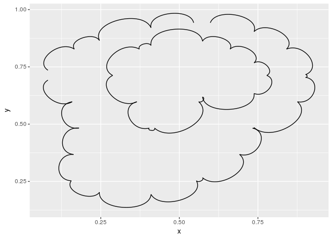
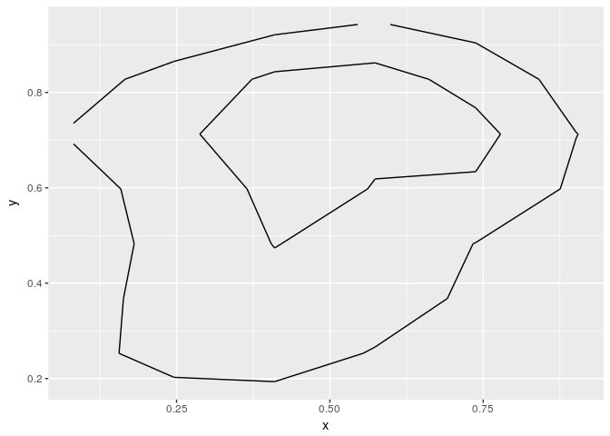
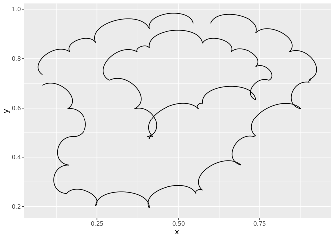
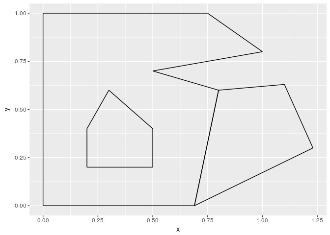
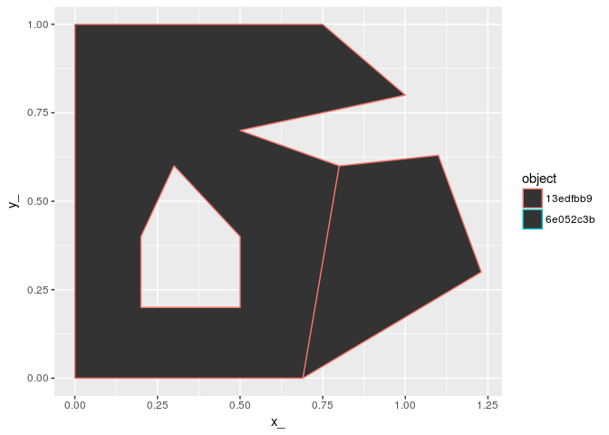

<!-- README.md is generated from README.Rmd. Please edit that file -->

[](https://travis-ci.org/hypertidy/scgraph)

[](https://ci.appveyor.com/project/hypertidy/scgraph)

# scgraph

The goal of scgraph is to convert anything expressible in [silicate
form](https://github.com/hypertidy/silicate) to igraph, and anything in
igraph form to silicate form.

In `silicate` general form the data can be offloaded or transmitted via
any standard table-based data system.

## Installation

You can install scgraph from github with:

``` r
# install.packages("devtools")
devtools::install_github("hypertidy/scgraph")
```

## Example

This is a basic example which shows you how to create graphs, from
non-graph data that has connectivity understood by the ‘sc’ framework.

First generate some line data.

``` r
library(silicate)
library(raster)
r <- aggregate(raster(volcano), fact = 10)
line <- sf::st_as_sf(rasterToContour(r, levels = c(130, 165)))
plot(line)
```

<!-- -->

Convert to graph, the first is a bit of a mess since we are plotting it
in “space”-space. The second does more work to show the topology more
clearly with two disconnected lines and the single ring.

(That’s the idea.)

``` r
library(scgraph)
plot(as.igraph(line), vertex.size = 5)
```

<!-- -->

``` r
plot(as.igraph(line, layout = FALSE), vertex.size = 5)
```

<!-- -->

Another example. Here the “hole” in the spatial polygon is seen as a
disconnected island, and the two polygons that share an edge running in
two different path directions are together.

``` r
data("minimal_mesh", package = "silicate")
set.seed(10)  ## WIP will currently always have new UIDs for the same data
sc_model <- SC(minimal_mesh)
ggeog <- as.igraph(sc_model, layout = TRUE)
gtopo <- as.igraph(sc_model, layout = FALSE)

## can't see how else to easily remove the geographic layout?
#igraph::V(gtopo)$name <- igraph::V(ggeog)$name
## drop IDs and use an integer
#igraph::V(gtopo)$name <- igraph::V(ggeog)$name <- seq_along(igraph::V(ggeog)$name)
#p <- par(mfrow = c(1, 2))
library(igraph)
#> 
#> Attaching package: 'igraph'
#> The following objects are masked from 'package:dplyr':
#> 
#>     as_data_frame, groups, union
#> The following object is masked from 'package:raster':
#> 
#>     union
#> The following objects are masked from 'package:stats':
#> 
#>     decompose, spectrum
#> The following object is masked from 'package:base':
#> 
#>     union
plot(ggeog, vertex.size = 9, main = "layout as geography", vertex.label.dist= .7, vertex.label.cex = 1)
```

<!-- -->

``` r
plot(gtopo, vertex.size = 9, main = "layout as topology", vertex.label.dist= .7, vertex.label.cex = 1)
```

<!-- -->

``` r
library(ggraph)
#> 
#> Attaching package: 'ggraph'
#> The following object is masked from 'package:sp':
#> 
#>     geometry
g <- as.igraph(line)
ggraph(g) + geom_edge_arc()
#> Using `nicely` as default layout
```

<!-- -->

``` r

ggraph(g) + geom_edge_link() 
#> Using `nicely` as default layout
```

<!-- -->

The geom edge link is essentially the same as the map data.

``` r
library(ggraph)
ggraph(ggeog) + geom_edge_arc()
#> Using `nicely` as default layout
```

<!-- -->

``` r

ggraph(ggeog) + geom_edge_link() 
#> Using `nicely` as default layout
```

<!-- -->

``` r

## reconstruct the sf object as a ggplot
## using the sc decomposition forms that scgraph uses
sc_model <- SC(minimal_mesh)
library(dplyr)
## a kind of db-fortify
tab <- with(sc_model, 
     object %>% inner_join(object_link_edge) %>% inner_join(edge))
#> Joining, by = "object_"
#> Joining, by = "edge_"
## this used to be PATH based, so was join-able, need a tidier way to express this
## cascade
tab$x1 <-sc_model$vertex$x_[ match(tab$.vx0, sc_model$vertex$vertex_)]
tab$y1 <-sc_model$vertex$y_[ match(tab$.vx0, sc_model$vertex$vertex_)]
tab$x2 <-sc_model$vertex$x_[ match(tab$.vx1, sc_model$vertex$vertex_)]
tab$y2 <-sc_model$vertex$y_[ match(tab$.vx1, sc_model$vertex$vertex_)]

library(ggplot2)
ggplot(tab, aes(x1, y1, xend = x2, yend = y2, col = object_)) + geom_segment()
```

<!-- -->
